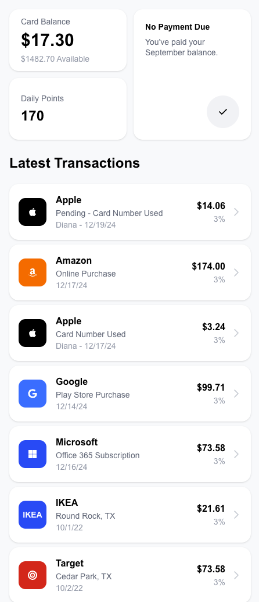
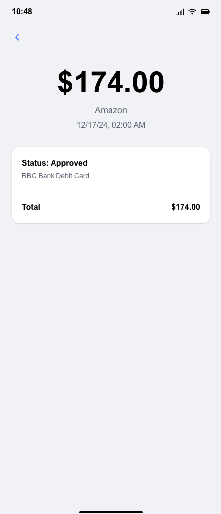

# Wallet Dashboard App

## 🛠 Tech Stack

- **Framework**: Next.js 15 (App Router)
- **Language**: TypeScript (strict mode)
- **Styling**: Tailwind CSS
- **Icons**: FontAwesome
- **Package Manager**: PNPM
- **Code Quality**: ESLint + Prettier

## 📱 Screenshots

### Main Dashboard



The main dashboard features a 2x2 grid layout with:

- Card balance with usage visualization
- No payment due status
- Daily points display
- Latest transactions list

### Transaction Details



Detailed transaction view showing:

- Transaction amount and type
- Merchant information with brand icons
- Date and authorization details
- Pending status indicators

## 🚦 Getting Started

### Prerequisites

- Node.js 18+
- PNPM package manager

### Installation

```bash
# Clone repository
git clone [repository-url]
cd gr_task_app

# Install dependencies
pnpm install

# Run development server
pnpm dev
```

### Available Scripts

```bash
pnpm dev        # Start development server
pnpm build      # Build for production
pnpm start      # Start production server
pnpm lint       # Run ESLint
pnpm format     # Format code with Prettier
```
